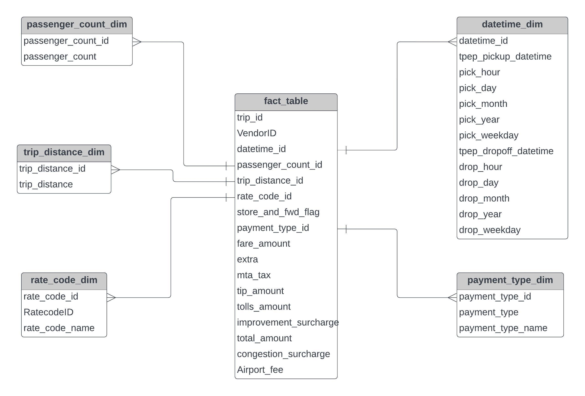

# Uber ETL Pipeline Data Engineering Project

## Introduction:

The goal of this project is to perform data analytics on Uber data using various tools and technologies. The project leverages the power of Google Cloud Platform, Python, and a Modern Data Pipeline Tool, Mage, along with other technologies such as Google Storage, Google Engine, BigQuery, and Looker Studio.

## Technology Stack:

### Languages:

- Python
- SQL

### Google Cloud Platform:

- Google Storage (Bucket)
- Google Engine (Compute Instance)
- BigQuery
- Looker Studio

### Modern Data Pipeline Tool:

- [Mage](https://www.mage.ai)

## Data Source:

The dataset is provided by TLC Trip Record Data, including yellow and green taxi trip records. It includes fields capturing pick-up and drop-off dates/times, pick-up and drop-off locations, trip distances, itemized fares, rate types, payment types, and driver-reported passenger counts.

**Data source link:** [TLC Trip Record Data](https://www.nyc.gov/site/tlc/about/tlc-trip-record-data.page)

**Data Dictionary:** [Data Dictionary for Trip Records Yellow](https://www.nyc.gov/assets/tlc/downloads/pdf/data_dictionary_trip_records_yellow.pdf)

## Data Model

Below is the data model representation for the Uber ETL Pipeline Data Engineering Project:

